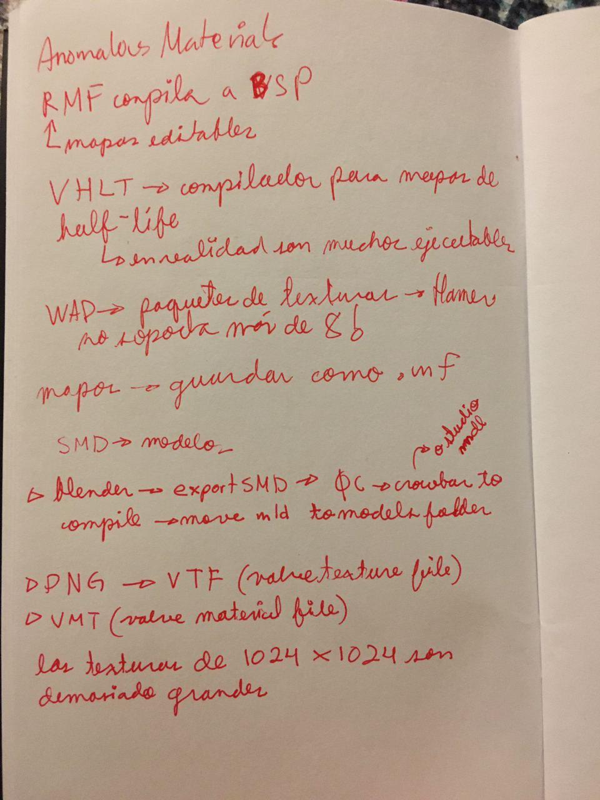

# Full-Life

Half-Life mod for proposing marriage.

## Install

- Built for Half-Life steam version.
- `git clone` this repo in `C:\Program Files (x86)\Steam\steamapps\common\Half-Life`.
- Copy `goose.wad` to `C:\Program Files (x86)\Steam\steamapps\common\Half-Life\valve`.
- Rename `c1a0.map` in `C:\Program Files (x86)\Steam\steamapps\common\Half-Life\valve\maps` to `c1a0_original.map`.
- Copy `c1a0.map` from `#Maps` to `C:\Program Files (x86)\Steam\steamapps\common\Half-Life\valve\maps`.
- Start Half-Life.

## Dev notes

You don't need to follow these :) This is just happy documentation, mostly for me.

I was super lucky the Half Life SDK includes one of the very first maps in the game. That is the map I modified and then introduced to the Half Life installation.

### Tools

- [VHLT version 34](https://sites.google.com/site/gshltools/compiler-tools) - for map compiling. I installed it in `C:\half-life-tools\tools`
- [Wally](https://valvedev.info/tools/wally/) - for vtf and vmt management and compile to wad.
- [Blender Source Tools](https://developer.valvesoftware.com/wiki/Blender_Source_Tools) - for exporting from Blender to SMD
- [Blender](https://www.blender.org/)
- [GIMP](https://www.gimp.org/)

### Instructions

- Images max size is 512x512.

#### For custom models

- Export xcf image as bmp in GIMP. Make sure `Image > Mode > Indexed` is checked. When exporting, make sure `Compatiblity Options > Do not write color space information` is checked.
- Blender material should be named as the bmp image.

#### For already existing entities

- Add jpgs on Wally.
- Add WAD from valve folder to map file (c1a0).
- Copy WAD to mod folder, and to valve folder.

## The good documentation <3

Nothing beats looking at the original Half Life code.

### Youtube

- [Half Life modding tutorial series by Rolling Barrel](https://www.youtube.com/watch?v=ZcKyLVHOdkY) (The gateway for tihs mod, extremely useful tutorials)
- [Export from 3ds Max and importing into hammer](https://www.youtube.com/watch?v=i3geWVa3hT4)
- [HAMMER: Advanced Tutorial #6 Part 2 Custom Models (Props)](https://www.youtube.com/watch?v=Dam1fy5Bi7A)
- [Gamebanana.com How to add .mdl files into map (Hammer Editor)](https://www.youtube.com/watch?v=pe1DOPPritE)

### The Whole Half Life

- [Model Compiling Error](https://twhl.info/thread/view/17115?page=1#post-284066)
- [Modelling for Goldsource](https://twhl.info/wiki/page/Tutorial%3A_Modelling_for_Goldsource)
- [Tutorial: Source Modelling Setup](https://twhl.info/wiki/page/Tutorial%3A_Source_Modelling_Setup) (for HL2, but still useful)
- [mod_numforname error](https://twhl.info/index.php/thread/view/19485)

### Valve developer community

- [Studiomdl](https://developer.valvesoftware.com/wiki/Studiomdl) (newer version, a lot of stuff here is not needed, for example, the `-game` flag)
- [Model Creation Overview](https://developer.valvesoftware.com/wiki/Model_Creation_Overview)
- [Compiling a model](https://developer.valvesoftware.com/wiki/Compiling_a_model)
- [https://developer.valvesoftware.com/wiki/Blender_Source_Tools_Help](https://developer.valvesoftware.com/wiki/Blender_Source_Tools_Help)

### Others

- [How would I import models into Hammer editor? - Reddit: r/hammer](https://www.reddit.com/r/hammer/comments/edlh9x/how_would_i_import_models_into_hammer_editor/)
- [GoldSrc Model Troubleshooting List](http://the303.org/tutorials/gold_mdl_fix.htm)
- [Export file as palleted 8bit per pixel BMP from GIMP](https://superuser.com/questions/678434/export-file-as-palleted-8bit-per-pixel-bmp-from-gimp/678886#:~:text=Yes%2C%20in%20GIMP%20you%20can,it's%20a%20quite%20simple%20operation.&text=8%20bit%20image%20means%20256,palette%20could%20be%20modified%20afterwards.)
